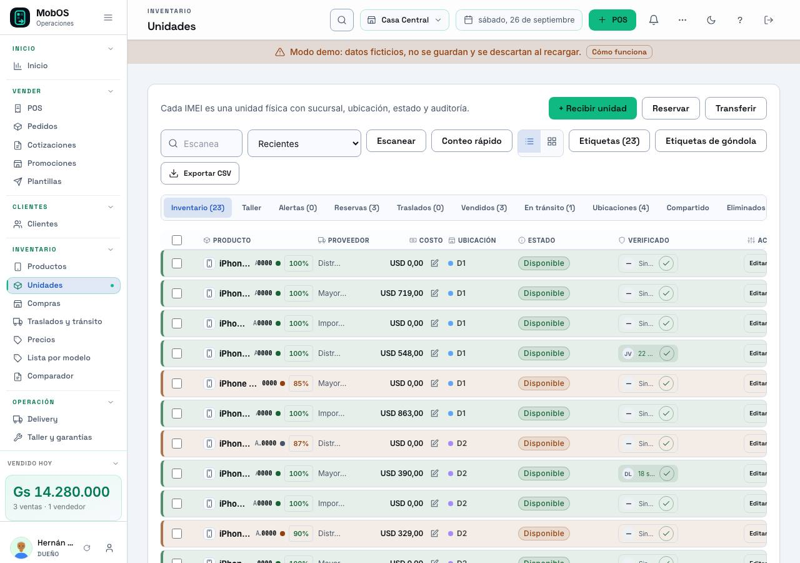
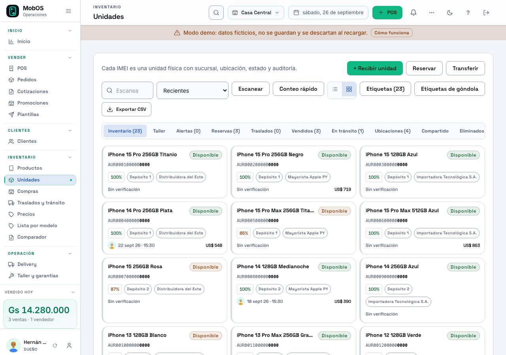
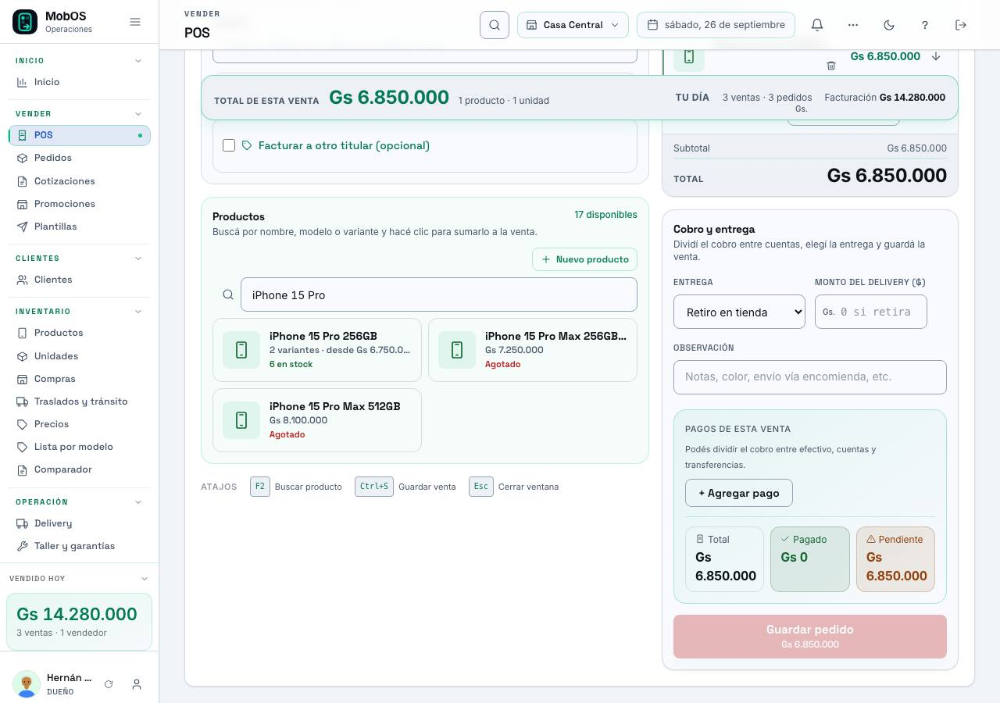
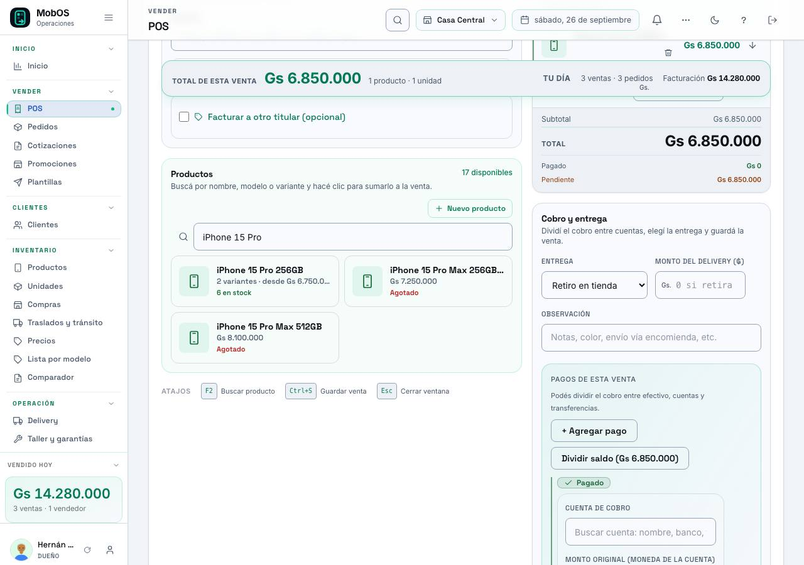
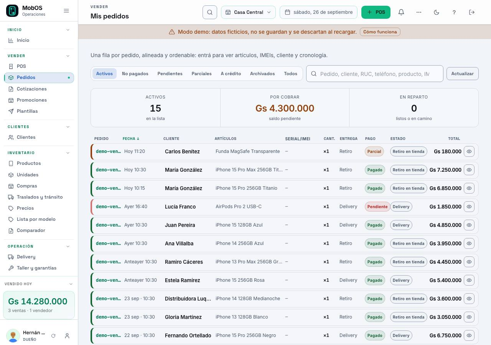
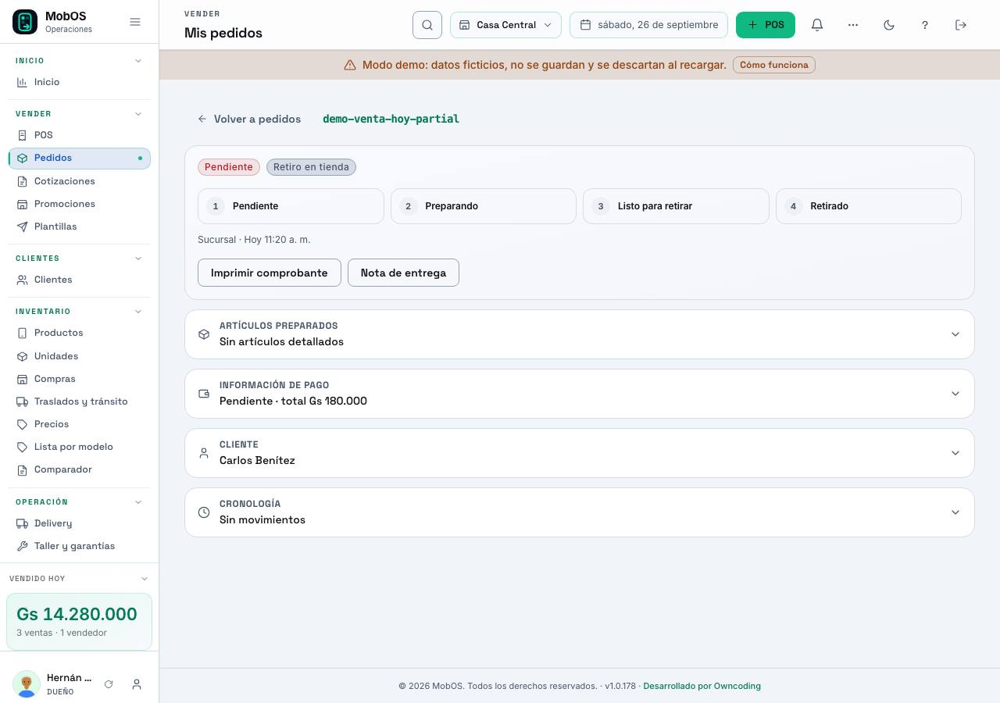
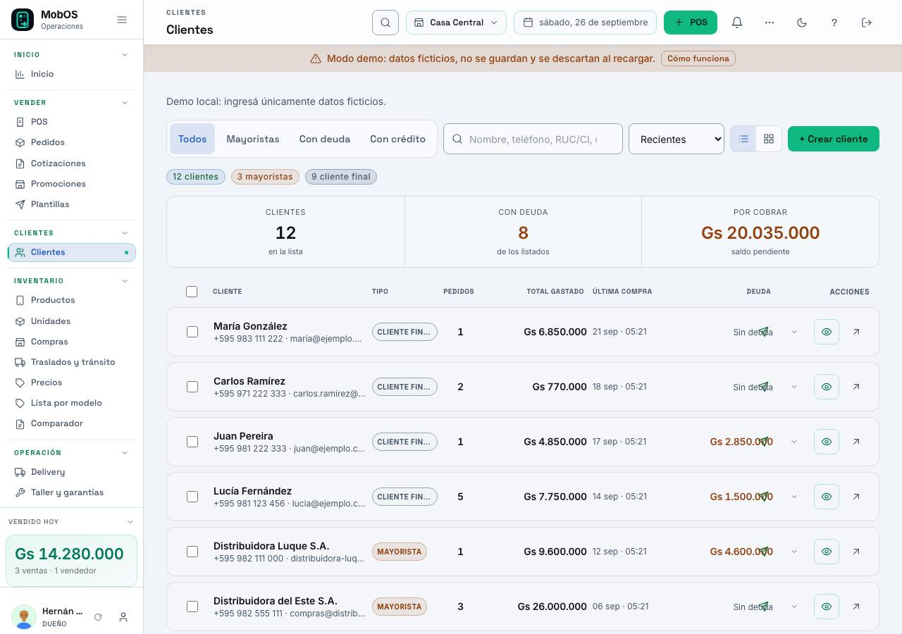
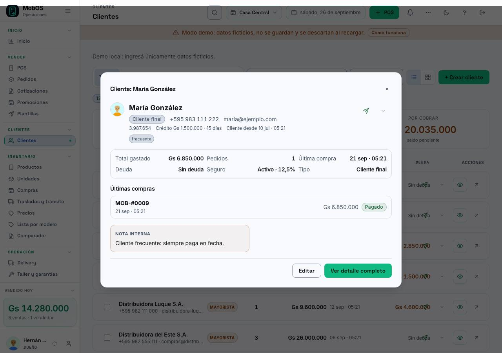
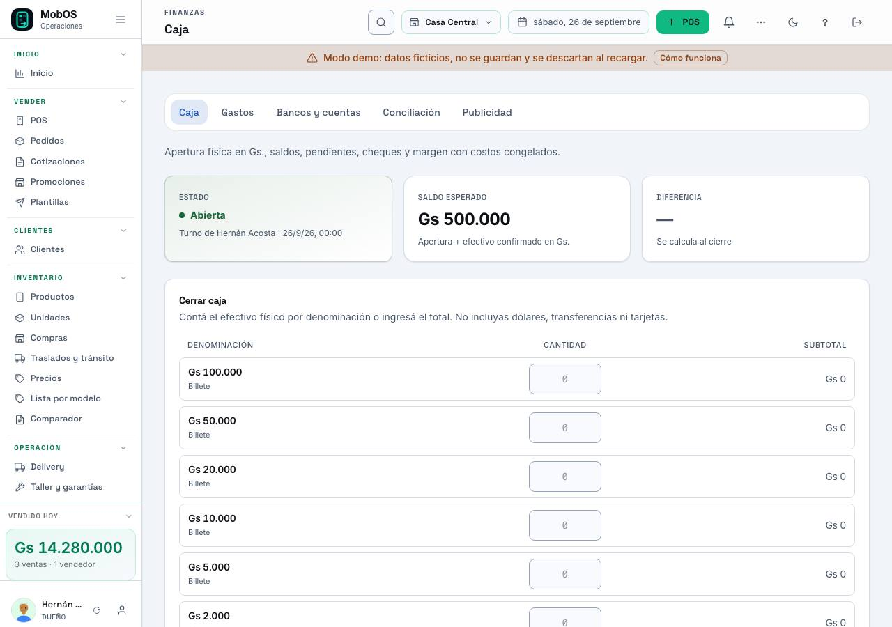
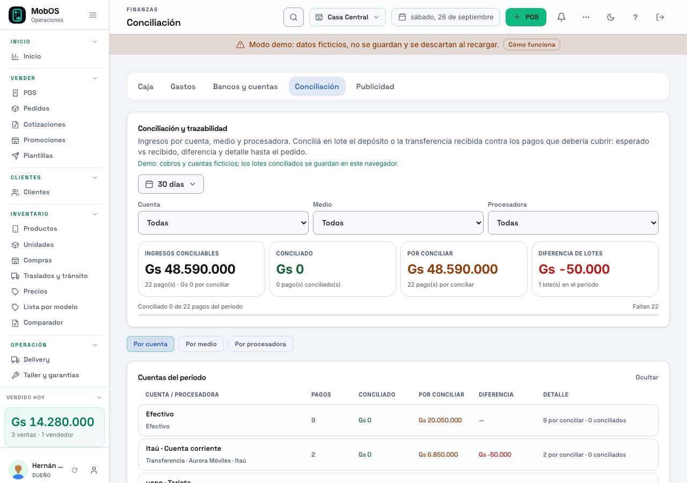

# Paquete de activación F4 (#241) — rollout v2 "device ops"

_26/09/2026 · **APROBADO por Dario y activado** · referencia contra producción **v1.0.178**._

Este documento es la guía para **activar y verificar** el rollout v2. El
paquete de aprobación (qué cambia por dominio, con capturas) es
[`PAQUETE-F4.md`](PAQUETE-F4.md); acá está el orden, el switch y qué mirar.

## Activar F4 (un solo paso)

**✅ Aprobado por Dario el 26/09/2026: el v2 es el diseño por defecto** (ya
activo en producción v1.0.178). Para prenderlo o volver atrás alcanza con **una
variable en Coolify + redeploy**, sin tocar código; el **toggle para volver al
diseño anterior se mantiene por un tiempo** (por dispositivo, en Preferencias):

| Acción | Cambio |
|---|---|
| **Activar** | `VITE_TEMA_V2` sin definir o `1` → redeploy *(estado actual, aprobado)* |
| **Volver al diseño anterior** | `VITE_TEMA_V2=0` → redeploy |
| Solo este dispositivo | Preferencias → «Volver al diseño anterior» |

Revisión visual antes de dar el OK: las **capturas finales por dominio** de
abajo; para verlo en vivo, `app.moboss.online/demo` (entrar como Dueño) es el
mismo sistema con datos ficticios.

## Switch (ya listo)

| `VITE_TEMA_V2` | Efecto |
|---|---|
| sin definir o `1` | **F4 activo** (estado actual): el v2 es el diseño por defecto |
| `0` | F4 apagado: se ve el diseño anterior; el v2 queda como prueba por dispositivo |

- Se cambia en las variables de entorno del front en **Coolify** y se redespliega
  (Vite inyecta el valor en el build). No requiere tocar código.
- **Por dispositivo** (siempre manda): `localStorage['mobos:tema-v2'] = '0'`
  vuelve al diseño anterior y `'1'` regresa al v2. El selector visible está en
  **Configuración → Sistema → Preferencias → «Volver al diseño anterior»**.
- Detalle y rollback: [`PAQUETE-F4.md`](PAQUETE-F4.md) §Switch de activación.

## Checklist del rollout (pantallas y estado)

| # | Pantalla | Ruta | Estado | Evidencia | Verificación |
|---|---|---|---|---|---|
| 1 | **Shell** (barra lateral/topbar, densidad, foco) | todas | ✅ activo | `docs/qa/241-shell-aa/`, `docs/qa/241-shell-produccion/` | `e2e/dsn-241-a11y.spec.js` (8/8), AA prod 0 bajos |
| 2 | **Resumen** (KPIs en tiles, hero) | `/resumen` | ✅ activo | `activacion-f4/resumen-*`, `c241f4b-resumen-on-*` | smoke + gate responsive |
| 3 | **POS** (carrito dinámico, cobro, entrega) | `/pos` | ✅ activo | `activacion-f4/dominios/02-pos-*`, `c241f4b-pos-*` | smoke, `qa-249-pos-touch` |
| 4 | **Pedidos** (lista + detalle con stepper) | `/pedidos` | ✅ activo | `activacion-f4/dominios/03-pedidos-*`, `c241f4b-pedidos-on-*` | smoke, gate responsive |
| 5 | **Clientes** (lista, ficha, resumen rápido) | `/clientes` | ✅ activo | `activacion-f4/dominios/04-clientes-*`, `c241f4b-clientes-on-*` | `qa-249-clientes-touch` |
| 6 | **Inventario** (tabla, ficha, tiles, taller/rack) | `/inventario/*` | ✅ activo (tiles con grado/locks: próxima vuelta con INV) | `activacion-f4/dominios/01-inventario-*`, `c241f4b-taller-on-*` | `qa-249-inventario-touch` |
| 7 | **Compras** (tiles y "x de y" de recepción) | `/compras` | ✅ activo | `c241f4b-compras-on-*` | specs de compras |
| 8 | **Finanzas** (Caja, Conciliación, Cuentas) | `/finanzas/*` | ✅ activo | `activacion-f4/dominios/05-finanzas-*`, `c241f4b-finanzas-on-*` | `finanzas-caja`, conciliación |
| 9 | **Servicio y Garantías** (pipeline y stepper) | `/servicio`, `/garantias` | ✅ activo | `c241f4b-servicio-on-*`, `…-garantias-on-*` | `qa-241-servicio-*` |
| 10 | **Configuración en 7 grupos** (riel + iconos) | `/configuracion/*` | ✅ activo | `docs/qa/253-config-grupos/finales/`, `activacion-f4/configuracion-*` | `qa-253-config-grupos` 4/4 |
| 11 | **Públicas** (pedido por token, informe `/u/:serial`, landing) | varias | ✅ activo | `c241f4b-pedido-publico-on-*`, `…-landing-on-*` | `qa-240-informe`, `public-*` |
| 12 | **Tablero operativo** (`/ops`, sin flag) | `/ops` | ✅ activo (entrada en el menú: decisión de producto) | `activacion-f4/ops-*`, `c241f4b-ops-on-*` | `ops.spec.js` |
| 13 | **Impresión** (comprobantes, etiquetas, vista previa del rollo) | varias | 🟡 parcial: informe/certificado con el lote H | `c241f4b-taller-impresion-on-*` | `impresion-remota`, `etiquetas-*` |
| 14 | **Mobile #249** (áreas de 44 px, sin scroll) | todas | ✅ cerrado | `docs/qa/249-cierre-responsive/`, `docs/QA-RESPONSIVE-MOBILE.md` | gate `dsn-responsive-mobile` 12/12 |
| 15 | **AA del shell** | todas | ✅ cerrado | `docs/qa/241-shell-aa/`, `docs/qa/241-shell-produccion/` | `QA-241-shell-aa.md` |

## Capturas finales por dominio (producción v1.0.178)

Orden del rollout: **inventario → POS → pedidos → clientes → finanzas**. Todas
viven en `docs/qa/activacion-f4/dominios/` (22 JPGs) y se reproducen con
`node scripts/qa-activacion-f4-dominios.mjs`.

### 1 · Inventario

Qué mirar: filtros y solapas, tiles de equipo (IMEI, batería, depósito,
proveedor y costo) y la ficha en celular.
Más: `01-inventario-taller-desktop-claro.jpg` (modo taller/rack),
`01-inventario-lista-desktop-oscuro.jpg`, `01-inventario-ficha-mobile-claro.jpg`.

### 2 · POS

Qué mirar: carrito dinámico por estados, total y pagos divididos, entrega.
Más: `02-pos-inicio-desktop-claro.jpg`, `02-pos-inicio-desktop-oscuro.jpg`,
`02-pos-carrito-mobile-claro.jpg`.

### 3 · Pedidos

Qué mirar: filtros en píldora, resumen, y el stepper del flujo de entrega en el
detalle.
Más: `03-pedidos-lista-desktop-oscuro.jpg`, `03-pedidos-lista-mobile-claro.jpg`.

### 4 · Clientes

Qué mirar: chips y filtros, resumen en tiles y el popup de resumen rápido.
Más: `04-clientes-lista-desktop-oscuro.jpg`, `04-clientes-lista-mobile-claro.jpg`.

### 5 · Finanzas

Qué mirar: Caja en tiles, Conciliación con «x de y» y solapas.
Más: `05-finanzas-caja-desktop-oscuro.jpg`, `05-finanzas-caja-mobile-claro.jpg`.

## Orden de activación y verificación

1. **Switch**: confirmar `VITE_TEMA_V2` en Coolify (hoy sin definir = activo).
   Si se quiere volver atrás, `0` + redeploy.
2. **Deploy** del release que incluya las integraciones pendientes.
3. **Verificación automática**:
   - `node scripts/qa-241-shell-produccion.mjs` → AA del shell en producción.
   - `npm run test:e2e:smoke` y el gate `e2e/dsn-responsive-mobile.spec.js`.
   - `node scripts/qa-activacion-f4-capturas.mjs` → capturas finales del estado
     desplegado (mismo set que `docs/qa/activacion-f4/`).
4. **Verificación visual del dueño** (10 minutos): shell y navegación, POS con
   un producto en el carrito, Pedidos, Configuración (riel de 7 grupos), Tablero
   `/ops` y el portal público del pedido.
5. **Rollback** (si algo molesta): por dispositivo desde Preferencias o global
   con el switch en `0`.

### Verificación post-.178 (26/09/2026)

Con F4 activado por defecto sobre **v1.0.178**:

| Verificación | Resultado |
|---|---|
| `npm run test:e2e:smoke` | **19/19** |
| Suite e2e completa (`npm run test:e2e`) | **479 passed · 0 flaky · 0 fallos** (10 skip) |
| AA del shell en producción (`qa-241-shell-produccion.mjs`) | **0 bajos** en los 6 estados |
| AA/opt-out local (`dsn-241-a11y.spec.js`) | **8/8**, incluido el pin del default (`data-tema-v2="1"`) y el toggle (`0`) |
| Capturas | producción v1.0.178: 15 de panorama + 22 por dominio + 6 del shell |

## Capturas finales

- **Por dominio, para la activación**: `docs/qa/activacion-f4/dominios/`
  (22 JPGs en el orden inventario → POS → pedidos → clientes → finanzas; se
  reproducen con `node scripts/qa-activacion-f4-dominios.mjs`). Las principales
  están embebidas más arriba.
- **Estado desplegado (producción v1.0.178)**: `docs/qa/activacion-f4/`
  (15 JPGs: resumen, POS, pedidos, clientes, inventario, finanzas, configuración
  y `/ops` en desktop claro; oscuro para resumen/POS/ops; mobile claro para
  POS/pedidos/configuración/ops).
- **Por dominio, con claro/oscuro × 390/1280**: los `c241f4b-*` de
  [`PAQUETE-F4.md`](PAQUETE-F4.md) (306 capturas en `docs/rediseno/`).
- **Configuración (7 grupos)**: `docs/qa/253-config-grupos/finales/`.
- **AA del shell**: `docs/qa/241-shell-aa/` (local) y
  `docs/qa/241-shell-produccion/` (producción).

## Notas para Dario

- **Qué cambia al activar**: sólo presentación y navegación (shell, tiles,
  steppers, chips y números grandes). Reglas de negocio, permisos y datos siguen
  igual; el diseño anterior queda completo y accesible.
- **Qué mirar primero**: la barra lateral y el topbar, el carrito del POS, el
  riel de Configuración y el tablero `/ops`.
- **Decisiones abiertas** (no bloquean la activación):
  1. ¿Prints (informe/certificado) entran ahora o en la segunda vuelta? (lote H)
  2. ¿La entrada del tablero `/ops` va al menú del dueño? (hoy se llega por URL)
  3. ¿La densidad del topbar (64 px) queda como está?
- **Deudas anotadas**: grado/locks en los tiles del inventario (próxima vuelta
  con INV); copias locales de `PasosEquipo`/`FichaCertificado` conviven con
  owncoding-ui v0.30.0 (adopción final: CMP).
- **Ya cerrado**: responsive mobile #249 (cero targets < 44 px en mobile),
  contraste AA del shell (local y producción) y el switch de F4 por entorno.
